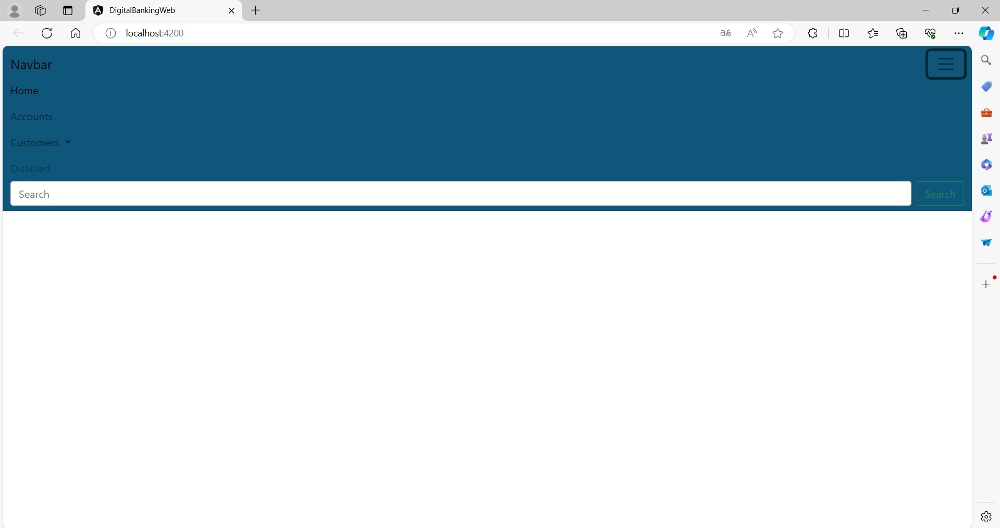
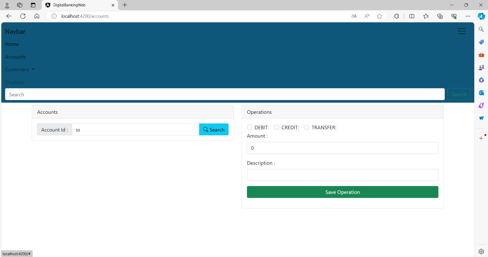
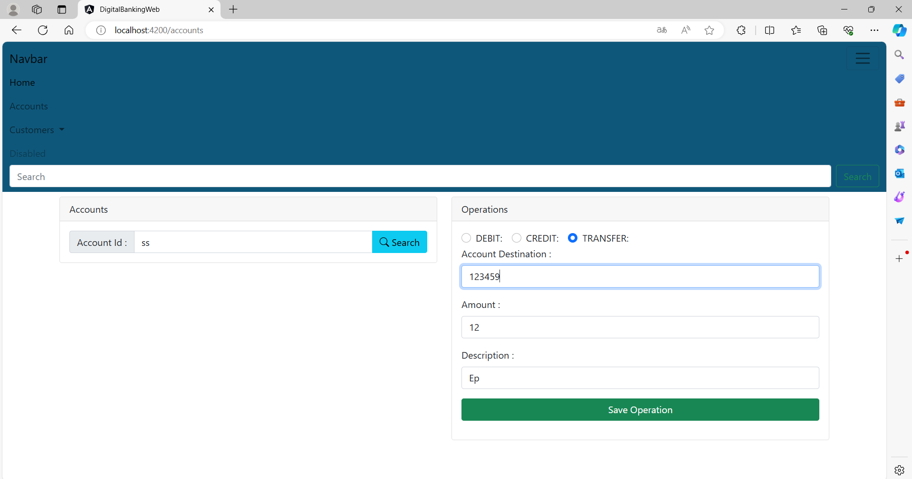
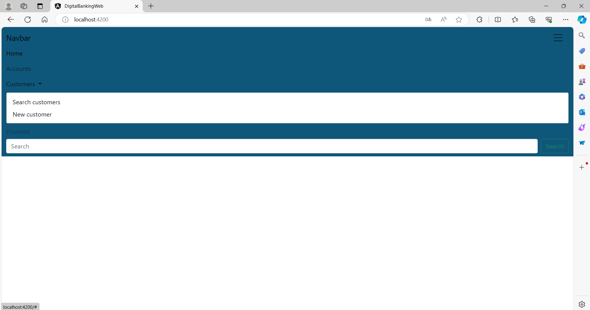

# Ebanking Application

## Description
Ebanking est une application de gestion bancaire en ligne permettant aux utilisateurs de gérer leurs comptes, effectuer des transactions et consulter leurs historiques bancaires. L'application est développée avec une architecture backend en J2EE et un frontend en Angular.

## Table des Matières
- [Fonctionnalités](#fonctionnalités)
- [Prérequis](#prérequis)
- [Installation](#installation)
- [Configuration](#configuration)
- [Lancement de l'Application](#lancement-de-lapplication)
- [Utilisation](#utilisation)
- [Tests](#tests)
- [Contribution](#contribution)
- [Licence](#licence)

## Fonctionnalités
- Création et gestion de comptes utilisateurs
- Consultation des soldes et des historiques de transactions
- Transferts d'argent entre comptes
- Gestion des bénéficiaires
- Notifications et alertes

## Prérequis
- Java Development Kit (JDK) 8 ou supérieur
- Apache Maven
- Node.js et npm (Node Package Manager)
- Angular CLI
- Serveur d'application J2EE (par exemple, Apache Tomcat)
- Base de données relationnelle (par exemple, MySQL)

## Installation

### Backend (J2EE)
1. Clonez le dépôt :
    ```bash
    git clone https://github.com/votre-utilisateur/ebanking-backend.git
    cd ebanking-backend
    ```

2. Compilez et packagez l'application :
    ```bash
    mvn clean install
    ```

3. Déployez le fichier WAR généré sur votre serveur d'application J2EE (par exemple, Apache Tomcat).

4. Configurez la connexion à la base de données dans le fichier `application.properties` situé dans `src/main/resources`.

### Frontend (Angular)
1. Clonez le dépôt :
    ```bash
    git clone https://github.com/votre-utilisateur/ebanking-frontend.git
    cd ebanking-frontend
    ```

2. Installez les dépendances :
    ```bash
    npm install
    ```

3. Configurez les variables d'environnement dans le fichier `src/environments/environment.ts`.

## Configuration

### Backend
Assurez-vous de configurer correctement la connexion à la base de données dans le fichier `application.properties` :
```properties
spring.datasource.url=jdbc:mysql://localhost:3306/ebanking
spring.datasource.username=yourUsername
spring.datasource.password=yourPassword
spring.jpa.hibernate.ddl-auto=update
```
## Lancement de l'application

### Screen de l'application: 

### Page Home  : 
### Page Accounts : 

### Page Customers : 
### New Customers : 
